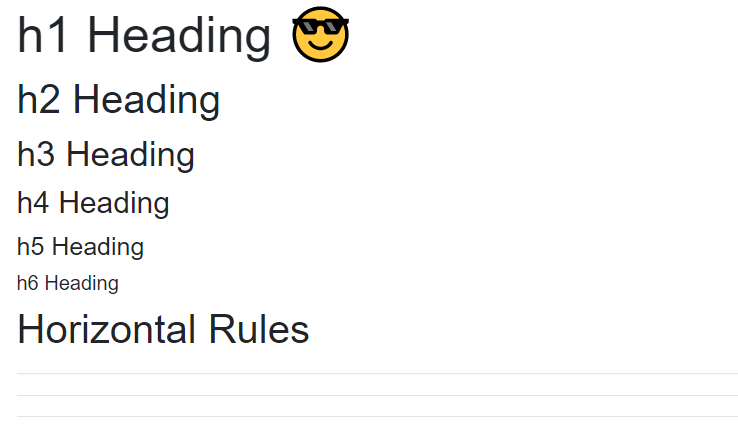
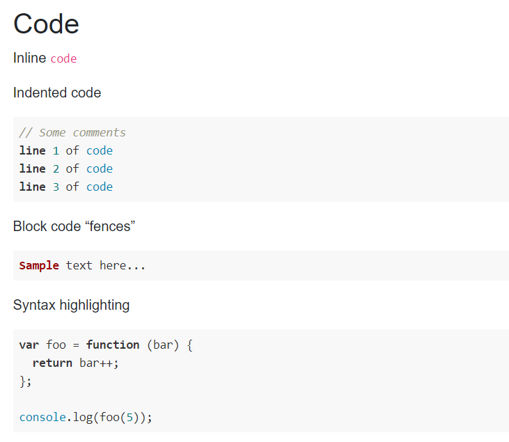
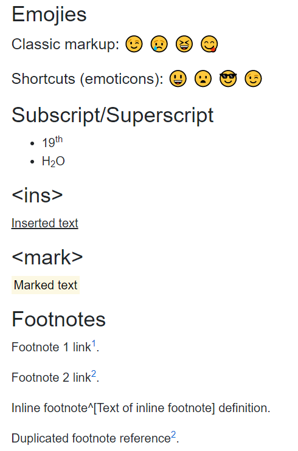
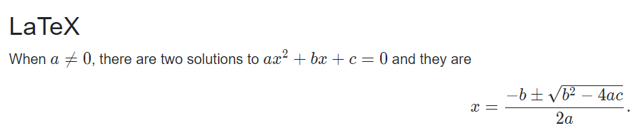
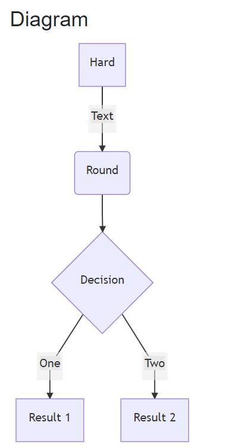

# RazorComponents.Markdown

   

Razor component for Markdown rendering.

Online demo:

- [GitHub Pages](https://acblog.github.io/posts/article)
- [Gitee Pages](https://acblog.gitee.io/posts/article)

## Features

Most features are based on Markdig.

- Abbreviations
- Auto identifiers
- Citations
- Custom containers
- Definition lists
- Emphasis extras
- Figures
- Footers
- Footnotes
- GridTables
- Mathematics
- Media links
  - Youtube
  - Bilibili
  - Netease music
- Pipe tables
- Task lists
- Diagrams, flowcharts
- Auto links
- Smarty pants
- Emoji
- Code highlighting

## Usage

1. Add the newest package on NuGet.

See https://www.nuget.org/packages/StardustDL.RazorComponents.Markdown for all versions.

```sh
dotnet add package StardustDL.RazorComponents.Markdown --version <version>
```

> For latest build, use the following source.
> https://sparkshine.pkgs.visualstudio.com/StardustDL/_packaging/feed/nuget/v3/index.json

2. Add static assets to `index.html`.

```html
<link rel="stylesheet" type="text/css" href="_content/StardustDL.RazorComponents.Markdown/highlight.js/github.css">
<link rel="stylesheet" type="text/css" href="_content/StardustDL.RazorComponents.Markdown/katex/katex.min.css">
<link rel="stylesheet" type="text/css" href="_content/StardustDL.RazorComponents.Markdown/css/markdown.css">

<script src="_content/StardustDL.RazorComponents.Markdown/component-min.js" type="text/javascript"></script>
<script src="_content/StardustDL.RazorComponents.Markdown/mermaid/mermaid.min.js" type="text/javascript"></script>
```

3. Add services.

```csharp
using StardustDL.RazorComponents.Markdown;

builder.Services.AddSingleton<IMarkdownComponentService, MarkdownComponentService>();
```

4. Use the component in Razor components.

```razor
<StardustDL.RazorComponents.Markdown.MarkdownRenderer Value="@MarkdownText" />
```

## Configuration

Use `IMarkdownComponentService` to configure.

```csharp
Service.EnableCodeHighlight = true;
Service.EnableDiagrams = true;
Service.EnableMathematics = true;
```

If you want to customize Markdown's parser pipeline, you can inherit inherit `MarkdownComponentService` and override the method `GetPipeline()`.

## Preview

Here are some screenshots from the demo project.

### Header



### Code with highlighting



### Extensions



### Mathematics



### Diagram



## Dependencies

- [Markdig](https://github.com/lunet-io/markdig)
- [Katex](https://github.com/KaTeX/KaTeX)
- [Mermaid.js](https://github.com/mermaid-js/mermaid)
- [Highlight.js](https://github.com/highlightjs/highlight.js)

## License

Apache-2.0
